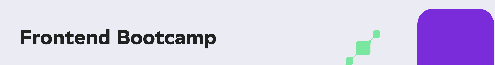

# s21_frontend_bootcamp

The Frontend Bootcamp at [School 21](https://21-school.ru/) covers the entire necessary technology stack for web developers. It includes 14 projects covering topics such as web design, JavaScript, setting up your own server, creating a database using an ORM, working with the DOM tree, sessions, cookies, and building complex projects from scratch. The course also includes React and the state manager Redux.

## [Day 00](day00/)

  
JavaScript Basics.

## [Day 01](day01/)

  
Deep Dive into Native JavaScript.

## [Day 02](day02/)

   
Fundamentals of Web Design.

## [Day 03](day03/)

    
Advanced HTML and CSS Development.

## [Day 04](day04/)

     
Introduction to Node.js.

## [Day 05](day05/)

     
Deep Dive into Node.js.

## [Team 00](team00/)

Team Project Sea Battle.

## [Day 06](day06/)

  
React Basics.
