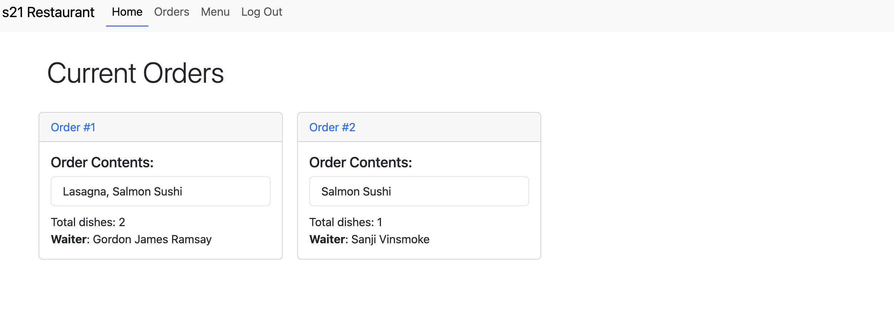
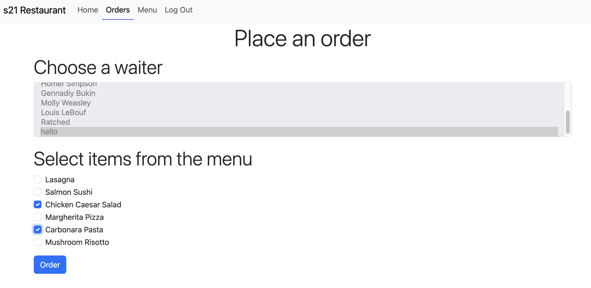
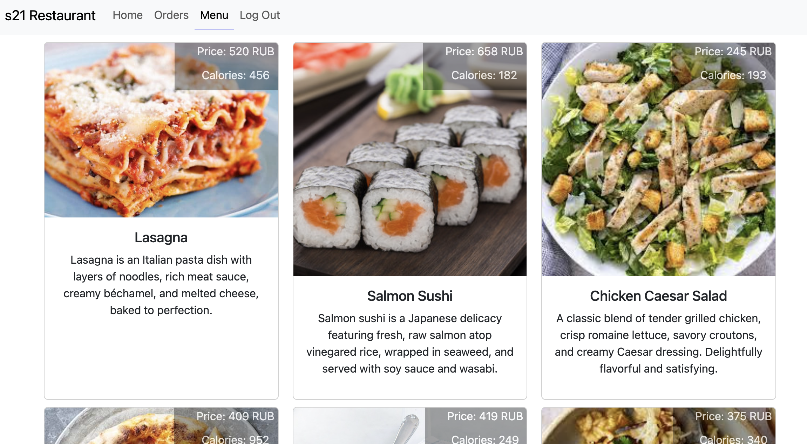
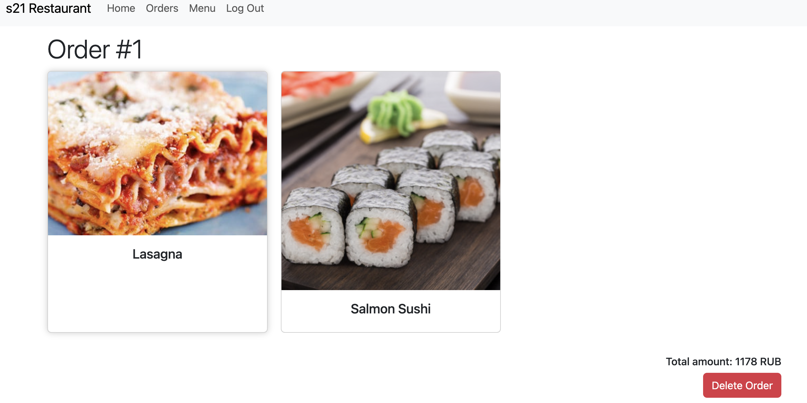

# Day 05 - Frontend boot camp

Template engines, Handlebars, Fetch API, Cookies, Sessions.

**Task 1**

Yesterday, you developed a service for a restaurant. Let's create a user interface (UI) representation for it. [The application should have 4 pages.](./src/chapter_1/Exercise_1.md)

**Task 2**

You've almost completed your application! Now let's make it a bit more realistic. You need to extend the user model in the database and add the fields username and login. Additionally, add two more pages to your application. These pages will display a user registration/login form. Users can register as waitstaff or admin. Depending on the user type, different pages will be accessible in the application. [User roles](./src/chapter_2/Exercise_2.md)

## Solution

[src files](src/)

To clear the database, perform a migration, and populate it with seeds, execute the following command:

```
npm run dbr
```

To start server on http://localhost:3000/:

```
npm run start
```

## Screenshots

Main Page


Orders Page


Menu Page


Order Page

