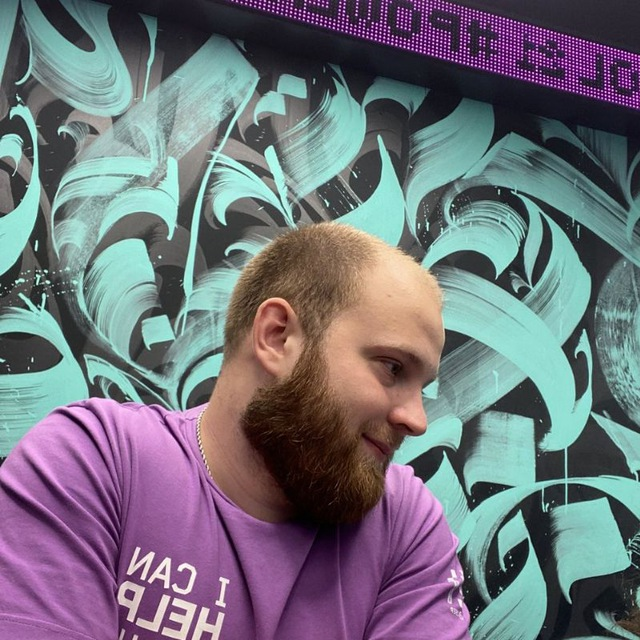
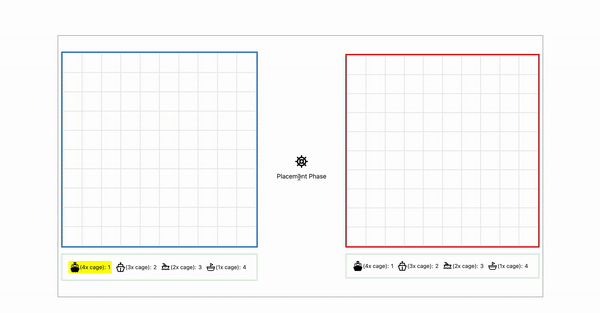
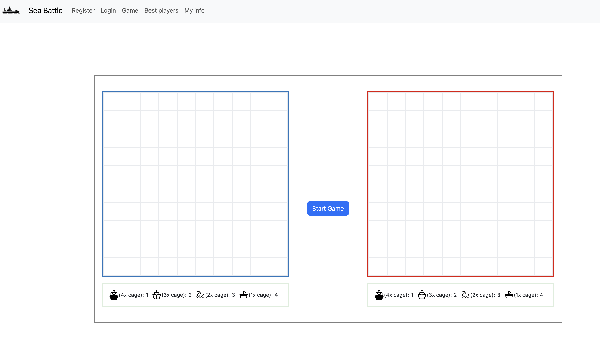

# Team 00 - Frontend boot camp

## Sea Battle

Today, you will need to write a game! It will be Battleship (Sea Battle).

In total, the application will have 5 pages:

1.  [Login page](./misc/images/Signin_Page.png) (localhost:3000/signIn)

2.  [Registration page](./misc/images/Signup_Page.png) (localhost:3000/signUp)

3.  On the main page (localhost:3000/) ([main page maket pregame](./misc/images/Main_Page.png)), there are game boards for players (you and the PC), as well as a start game button. When you click the start button, the ship placement phase begins. The ship placement mechanism is as follows: below the game board, there's a section listing the ships. After clicking on any ship, it is highlighted in the section. You click for the first time on a cell of the game board (this is the starting coordinate of the ship), and then you need to click on the last coordinate of the ship. A validation function is triggered. If everything is specified correctly, the ship is "placed" on the board. After all ships are placed, the game automatically starts ([game maket afteer game starts](./misc/images/Main_Page_startGame.png)). The opponent's ships are placed randomly. Then, the familiar process of the game begins: players take turns making moves and selecting a cell on the opponent's board to shoot. If a player hits a ship, it is displayed on the interface, and the right to make another move remains with the player who scored the hit. The game ends when all ships of one side are destroyed.

Rules for ship placement:  
 1. There should be a minimum of one cell between the ships.  
 2. Ships can only be placed horizontally or vertically.

4.  [Top players' rating](./misc/images/BestPlayers_Page.png) (localhost:3000/bestPlayers). Only players who have played more than 10 times are displayed on this page.
5.  [Your statistics page](./misc/images/MyState_Page.png) (localhost:3000/myStats).

    - Important! If you close the application while a game is not finished, the game is automatically considered lost.
    - The models for the database are at your discretion.

## Solution

[src files](src/)

### Team composition

| <center> Member </center>                                                                                                                                                            | Area of ​​responsibility                                                 |
| ------------------------------------------------------------------------------------------------------------------------------------------------------------------------------------ | ------------------------------------------------------------------------ |
| [](https://github.com/sheritsh)<br /> <center>[// sheritsh](https://github.com/sheritsh)</center> | SeaBattle and game logic.                                                |
| [](https://github.com/geratw)<br /> <center>[// brenettg](https://github.com/geratw)</center>     | Authentication, session management, API for top players, and statistics. |

### Commands

To clear the database, perform a migration, and populate it with seeds, execute the following command:

```
npm run dbr
```

To start server on http://localhost:3000/:

```
npm run start
```

## Screenshots

Game Screencast



Game Page


